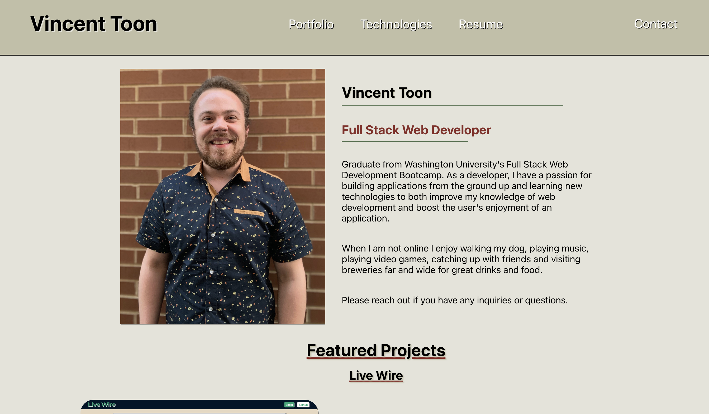

# React Portfolio

## License
### 
### [MIT](https://opensource.org/licenses/MIT)

## Description

This is a refactor and upgrade to my original react portfolio. In my original refactor, I muddied up the code and didn't like the way the project was laid out, so I invested time into making this one cleaner and more responsive.

By: [Vincent Toon](https://github.com/Vincenttoon)

## Table of Contents

* [Live Link](#live-link)

* [New Technologies](#new-technologies)

* [Installation](#installation)

* [Usage](#usage)

* [Old Deployment](#old-deployment)

* [Questions?](#questions)

## Live Link

* [Live Deployment](https://vincent-toon-portfolio.vercel.app/)

## New Technologies

* [EmailJs](https://www.emailjs.com/). Contact page functioning through EmailJs. Corresponding code located in src/pages/Contact/index.js

* [Vercel Deployment](https://vercel.com/). Deployment through vercel. Explored new deployment avenues after Heroku no longer served free deployments.

## Installation

* Head to the repository to download or view this code: [React Portfolio](https://github.com/Vincenttoon/vincent-toon-portfolio)

## Usage

* Visit live link. Send an email. View other projects. View known technologies. View resume. Enjoy.

### Old Deployment

* If interested, here is the [old Portfolio](https://vincenttoon.github.io/Toon-React-Portfolio/) made during my bootcamp

## Questions?

Questions, comments, or concerns? Please Email me at:
* vincenttoon22@gmail.com
